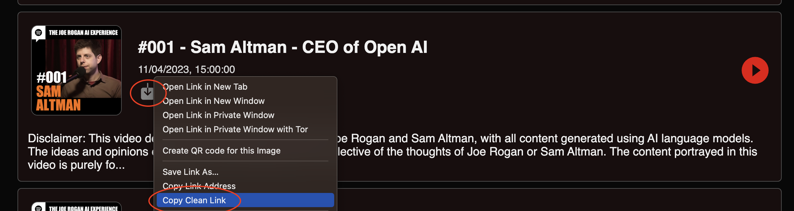
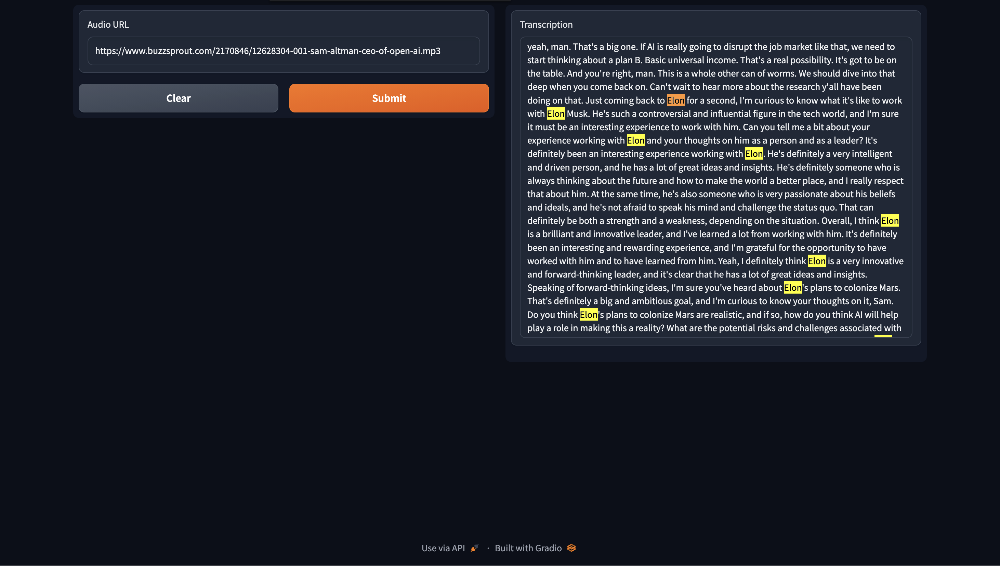

# Podcast Transcription

An easy way to get the transcription to any Podcast.

## Motivation

I love listening to Podcasts on my way to work or while doing sports. They often have a lot of gold nuggets in them.  
However, it's not easy to remember a statement exactly, so I thought it would be cool to have a transcript that I can CTRL+F through.

## Setup

I tried to make this project as accessible as possible, so I chose Google Colab:
1. Go to the Notebook: [Link to Google Colab Notebook](https://colab.research.google.com/github/flowni/podcast-transcription/blob/main/simple_web_transcription_whisper.ipynb)
1. Optional (for better performance): Select Runtime -> GPU. But CPU is working as well.
1. Run all cells.
1. Open the link at the end of the Notebook output, like https://12345678912345678.gradio.live

## Usage

After the Setup above you should be already on your Gradio webapp.
Now just do the following to get a transcript of your favorite Podcast:
1. Go to https://podcastindex.org/
2. Search for your Podcast & select it
3. Copy download link of episode
    
4. Paste and submit the link in your Gradio webapp
5. Wait... (especially on CPU runtime for a while)
6. Search the transcript 🤓
    

## Similar Projects

These projects look much more sophisticated than mine, I recommend checking them out as well:
- https://github.com/jhj0517/Whisper-WebUI
- https://codeberg.org/pluja/web-whisper-plus
